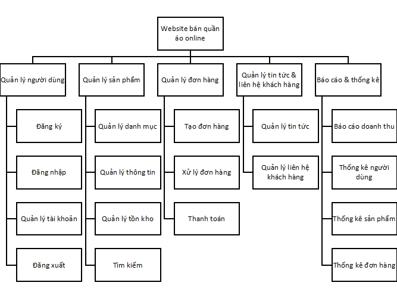
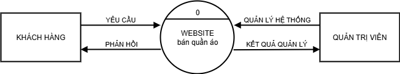
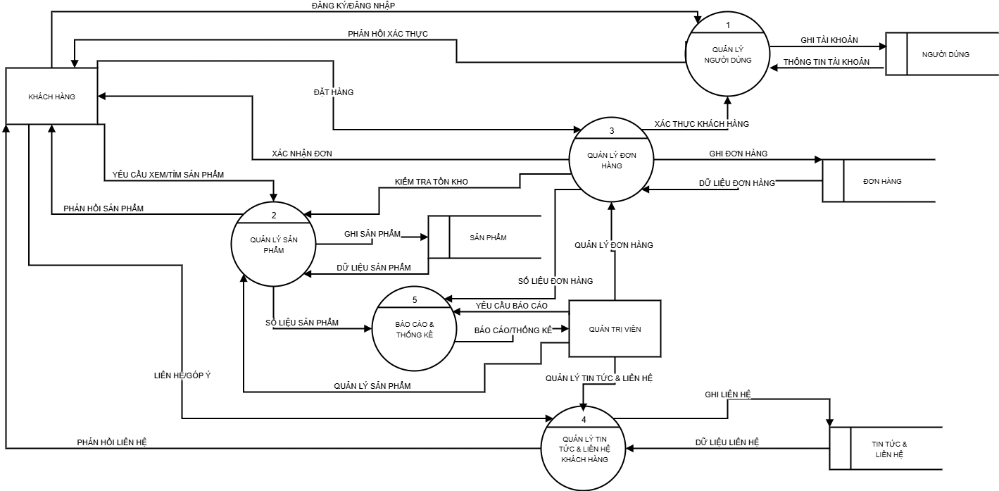

# DỰ ÁN WEBSITE THƯƠNG MẠI ĐIỆN TỬ

    </img>

---

- Trường Đại học Nha Trang NTU
- GVHD: Ths. Nguyễn Thị Hương Lý
- Nhóm sinh viên thực hiện: nhóm ??

#### Danh sách thành viên

| STT |      Họ và tên      |   MSSV   |   Chức vụ   |
| :-: | :-----------------: | :------: | :---------: |
| 1.  |     Hồ Vân Anh      | 65130065 | Thành viên  |
| 2.  |  Trương Ngự Quyền   | 64131995 | Nhóm trưởng |
| 3.  | Nguyễn Thị Hồng Nhi | 65132472 | Thành viên  |
| 4.  |   Nguyễn Lê Thịnh   | 64132299 | Thành viên  |

## Giới thiệu

- Giới thiệu chung:
- Lý do chọn chủ đề Website bán quần áo: phù hợp với đại đa số sở thích mua sắm của giới trẻ ngày nay, đặc biệt là thế hệ gen Z. Quần áo không chỉ để mặc để sưởi ấm, để làm việc mà còn dùng để làm đẹp, tôn vinh dáng vóc cơ thể. Nó gần gũi và luôn bên cạnh bản thân chúng ta. Ngày càng nhiều loại quần áo được ra đời để đáp ứng sở thích, thời trang, văn hóa của đại chúng. Vì thế, một website bán quần áo là một chủ đề tuy không mới nhưng luôn hấp dẫn trong thời buổi hiện nay.

## Công nghệ sử dụng

- [Wordpress] - Công cụ kéo thả các block để xây dựng website
- [Xampp] - Cung cấp môi trường để tạo cơ sở dữ liệu, quản lý, lưu trữ, truy xuất dữ liệu

## Các sơ đồ thiết kế

1. UseCase diagram
2. BFD

    </img>

3. DFD mức ngữ cảnh

    </img>

4. DFD mức 1

    </img>

## Giao diện trang web

## Đường dẫn website

## Video demo sản phẩm
